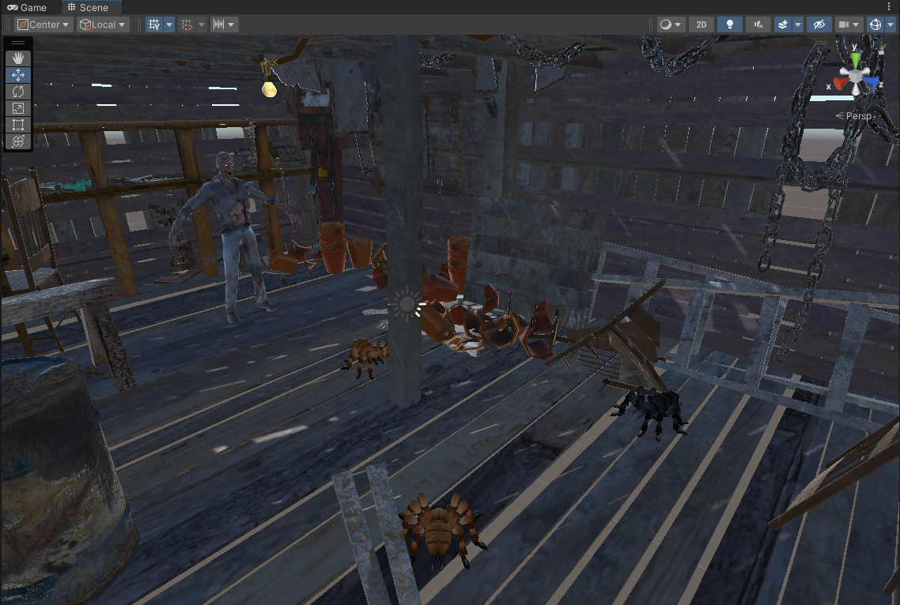
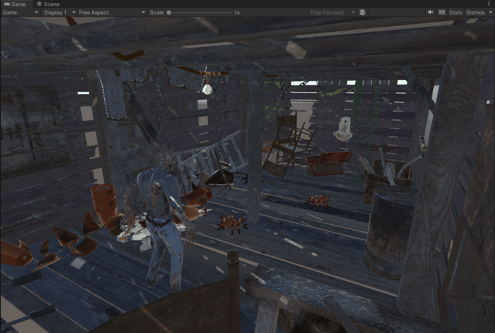
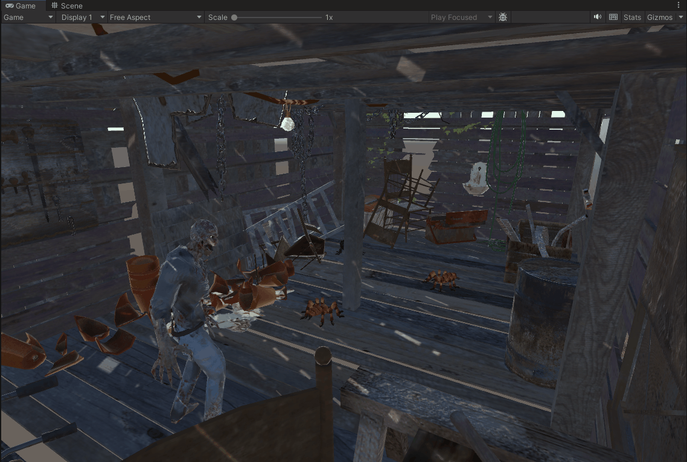
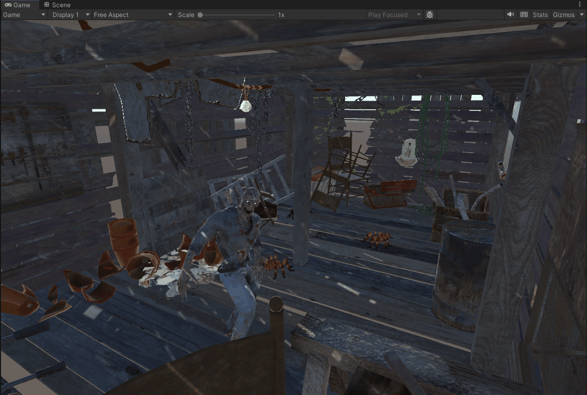

# Interfaces Inteligentes
## Examen 1 - Prueba VR

### Sesión 1  

- Ejercicio 1:
Se crea una escena con la caseta del paquete The Shed, tres arañas del paquete Free Fantasy Spider, y un zombie del paquete Hungry Zombie.  
  

- Ejercicio 2:  
El zombie se desplaza hacia delante y hacia atrás con 'W' y 'S', y rota con 'A' y 'D'.  
  

- Ejercicio 3:  
El zombie se teletransporta a la posición inicial al pulsar 'T'.  
  

- Ejercicio 4:  
Cuando el zombie se acerca a la pizarra, las sillas se desplazan hacia él y las macetas se mueven aleatoriamente.  
  

### Sesión 2  

- Ejercicio 5:
Cuando el zombie alcanza alguna silla todas las arañas se acercan a él.  
  